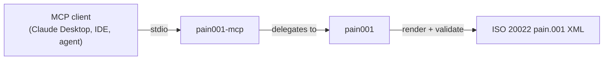

<!-- SPDX-License-Identifier: Apache-2.0 OR MIT -->

<p align="center">
  
</p>

<h1 align="center">pain001-mcp</h1>

<p align="center">
  <b>Model Context Protocol server exposing the pain001 ISO 20022 Customer Credit Transfer Initiation library as agent tools.</b>
</p>

<p align="center">
  <a href="https://pypi.org/project/pain001-mcp/"></a>
  <a href="https://pypi.org/project/pain001-mcp/"></a>
  <a href="https://pypi.org/project/pain001-mcp/"></a>
  <a href="https://github.com/sebastienrousseau/pain001-mcp/actions/workflows/ci.yml"></a>
  <a href="https://github.com/sebastienrousseau/pain001-mcp/actions/workflows/ci.yml"></a>
  <a href="#licence"></a>
</p>

---

**A [Model Context Protocol][mcp] server that exposes the [`pain001`][core]
ISO 20022 Customer Credit Transfer Initiation library as tools for AI agents
and assistants** - discover supported message versions, inspect input
schemas, validate payment records and financial identifiers, and generate
validated XML, all from your favourite MCP client.

> **Latest release: v0.0.52** - eleven MCP tools over stdio, all backed by the
> `pain001` public API, for Python 3.10+.
> [See what's new →][release-052]

## Contents

- [Overview](#overview)
- [Install](#install)
- [Quick Start](#quick-start)
- [Tools](#tools)
- [Using the tools](#using-the-tools)
- [Development](#development)
- [Licence](#licence)
- [Contribution](#contribution)
- [Acknowledgements](#acknowledgements)

## Overview

The [Model Context Protocol][mcp] (MCP) is an open standard that lets AI agents
and assistants discover and call external tools in a uniform way. **pain001-mcp**
is an MCP server that turns the [`pain001`][core] library into a set of
first-class agent tools, so an assistant can generate and validate **ISO 20022
`pain.001` Customer Credit Transfer Initiation XML messages** - the standardised
payment instructions that drive SEPA and cross-border credit transfers -
directly from a conversation.

Every tool is a thin, typed wrapper over the `pain001` public API (validators,
schema loaders, and `generate_xml_string`) so all interfaces behave
identically to the CLI and REST API. Tools return JSON-serialisable data; on
a validation error they return an `{"error": ...}` payload rather than
raising.

- **Website:** <https://pain001.com>
- **Source code:** <https://github.com/sebastienrousseau/pain001-mcp>
- **Bug reports:** <https://github.com/sebastienrousseau/pain001-mcp/issues>

This package is part of the **pain001 suite** - a set of independently
installable packages built around the `pain001` library:

- [`pain001`][core] - the core library (CLI + REST API)
- `pain001-mcp` - this package, the **Model Context Protocol** server
- [`pain001-lsp`][lsp] - the **Language Server Protocol** server for editors



## Install

**pain001-mcp** runs on macOS, Linux, and Windows and requires **Python 3.10+**
and **pip**. It pulls in the core `pain001` library and the MCP SDK
automatically.

```sh
python -m pip install pain001-mcp
```

<details>
<summary>Using an isolated virtual environment (recommended)</summary>

```sh
python -m venv venv
source venv/bin/activate        # macOS/Linux
venv\Scripts\activate           # Windows
python -m pip install -U pain001-mcp
```
</details>

## Quick Start

Launch the server over stdio (the FastMCP default transport):

```sh
pain001-mcp
```

Register it with any MCP client (e.g. Claude Desktop) by adding it to the
client's configuration:

```json
{
  "mcpServers": {
    "pain001": { "command": "pain001-mcp" }
  }
}
```

The agent can then call the tools below to validate payment data and generate
ISO 20022 messages on demand.

## Tools

All tools delegate to the `pain001` public API, so they behave identically to
the CLI and REST API.

| Tool | Purpose |
|------|---------|
| `list_message_types` | List the supported `pain.001` / `pain.008` message versions |
| `get_required_fields` | Required input fields for a message type |
| `get_input_schema` | Full input JSON Schema for a message type |
| `validate_records` | Validate flat records against a message type |
| `validate_identifier` | Validate an IBAN or BIC |
| `generate_message` | Generate a validated `pain.001` XML message |
| `generate_message_async` | Async variant of `generate_message` for long batches |
| `generate_message_from_file` | Render directly from a CSV path on disk |
| `list_supported_formats` | List the data formats `pain001` can load (CSV, SQLite, JSON, JSONL, Parquet) |
| `parse_camt053` | Parse a `camt.053` bank statement XML into structured data |
| `parse_pain002` | Parse a `pain.002` payment-status report XML into structured data |

## Using the tools

You can invoke the tools in-process - without a transport - straight through
the FastMCP instance. This mirrors what an agent receives over stdio. The
runnable version of this snippet lives in
[`examples/01_mcp_tools.py`](examples/01_mcp_tools.py). See the
[`examples/`](examples/) folder for a validation pipeline
([`02_validate_pipeline.py`](examples/02_validate_pipeline.py)) and a
bank-reply parser walkthrough
([`03_parse_bank_replies.py`](examples/03_parse_bank_replies.py)).

```python
import asyncio

from pain001_mcp.server import server

# A single flat payment record satisfying pain.001.001.09.
record = [
    {
        "id": "MSG-0001",
        "date": "2026-01-15T10:30:00",
        "nb_of_txs": 1,
        "ctrl_sum": 100.00,
        "initiator_name": "Acme Embedded Finance Ltd",
        "payment_information_id": "PMT-INFO-0001",
        "payment_method": "TRF",
        "batch_booking": False,
        "service_level_code": "SEPA",
        "requested_execution_date": "2026-01-20",
        "debtor_name": "Acme Embedded Finance Ltd",
        "debtor_account_IBAN": "DE89370400440532013000",
        "debtor_agent_BIC": "DEUTDEFFXXX",
        "charge_bearer": "SLEV",
        "payment_id": "PAY-0001",
        "payment_amount": 100.00,
        "currency": "EUR",
        "creditor_agent_BIC": "NWBKGB2LXXX",
        "creditor_name": "National Westminster Bank",
        "creditor_account_IBAN": "GB29NWBK60161331926819",
        "remittance_information": "Invoice 0001",
    }
]


async def main() -> None:
    async def call(name, args):
        result = await server.call_tool(name, args)
        content = result[0] if isinstance(result, tuple) else result
        return content[0].text if content else ""

    # Validate an identifier.
    print(await call("validate_identifier",
                     {"kind": "iban", "value": "DE89370400440532013000"}))
    # -> {"kind": "iban", "value": "DE89370400440532013000", "valid": true}

    # Generate a validated ISO 20022 Customer Credit Transfer Initiation.
    xml = await call("generate_message",
                     {"message_type": "pain.001.001.09", "records": record})
    print(xml[:46])  # -> <?xml version="1.0" encoding="UTF-8"?> ...


asyncio.run(main())
```

Run it directly:

```sh
python examples/01_mcp_tools.py
```

## Development

**pain001-mcp** uses [Poetry](https://python-poetry.org/) and
[mise](https://mise.jdx.dev/).

```bash
git clone https://github.com/sebastienrousseau/pain001-mcp.git && cd pain001-mcp
mise install
poetry install
poetry shell
```

A `Makefile` orchestrates the quality gates (kept in lockstep with CI):

```bash
make check        # all gates (REQUIRED before commit)
make test         # pytest
make lint         # ruff + black
make type-check   # mypy --strict
```

## Licence

Licensed under the [Apache Licence, Version 2.0][01]. Any contribution submitted
for inclusion shall be licensed as above, without additional terms.

## Contribution

Contributions are welcome - see the [contributing instructions][04]. Thanks to
all [contributors][05].

## Acknowledgements

Built on the [`pain001`][core] ISO 20022 Customer Credit Transfer Initiation
library and the [Model Context Protocol][mcp] Python SDK.

[01]: https://opensource.org/license/apache-2-0/
[04]: https://github.com/sebastienrousseau/pain001-mcp/blob/main/CONTRIBUTING.md
[05]: https://github.com/sebastienrousseau/pain001-mcp/graphs/contributors
[07]: https://pypi.org/project/pain001-mcp/
[core]: https://github.com/sebastienrousseau/pain001
[lsp]: https://github.com/sebastienrousseau/pain001-lsp
[mcp]: https://modelcontextprotocol.io
[release-052]: https://github.com/sebastienrousseau/pain001-mcp/releases/tag/v0.0.52
