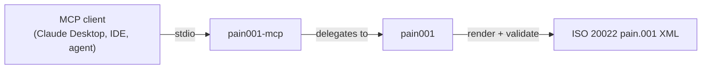

<!-- SPDX-License-Identifier: Apache-2.0 -->

<p align="center">
  
</p>

<h1 align="center">pain001-mcp</h1>

<p align="center">
  <b>Model Context Protocol server exposing the pain001 ISO 20022 payment library as 16 first-class agent tools.</b>
</p>

<p align="center">
  <a href="https://pypi.org/project/pain001-mcp/"></a>
  <a href="https://pypi.org/project/pain001-mcp/"></a>
  <a href="https://pypi.org/project/pain001-mcp/"></a>
  <a href="https://github.com/sebastienrousseau/pain001-mcp/actions/workflows/ci.yml"></a>
  <a href="https://github.com/sebastienrousseau/pain001-mcp/actions/workflows/ci.yml"></a>
  <a href="#license"></a>
  <a href="https://glama.ai/mcp/servers/sebastienrousseau/pain001-mcp"></a>
</p>

---

## Contents

**Getting started**

- [What is pain001-mcp?](#what-is-pain001-mcp) — the problem it solves
- [Install](#install) — PyPI, virtualenv, Docker
- [Quick start](#quick-start) — register with Claude Desktop in 30 seconds

**Library reference**

- [Tools](#tools) — the 16 tools, one resource, one prompt
- [Using the tools](#using-the-tools) — call them in-process from Python
- [The pain001 suite](#the-pain001-suite) — core lib, MCP server, LSP server

**Operational**

- [When not to use pain001-mcp](#when-not-to-use-pain001-mcp) — honest boundaries
- [Development](#development) — gates, make targets
- [Security](#security) — sandboxing posture
- [Documentation](#documentation) — examples, guides
- [Contributing](#contributing) — how to get changes in
- [License](#license) — Apache-2.0

---

## What is pain001-mcp?

The [Model Context Protocol](https://modelcontextprotocol.io) (MCP) is
an open standard that lets AI agents discover and call external tools in
a uniform way. **pain001-mcp** is the MCP server that turns the
[`pain001`](https://github.com/sebastienrousseau/pain001) ISO 20022
payment library into 16 first-class agent tools — so an assistant can
generate and validate **`pain.001` Customer Credit Transfer Initiation**
and **`pain.008` Customer Direct Debit Initiation** messages (the
standardised payment instructions behind SEPA and cross-border credit
transfers) directly from a conversation.

Every tool is a thin, typed wrapper over the `pain001` public API
(validators, schema loaders, `generate_xml_string`, parsers, the version
mapper, the ISO 20022 charset sanitiser), so all interfaces behave
identically to the CLI, REST API, and in-tree MCP server. Tools return
JSON-serialisable data; on a validation error they return an
`{"error": ...}` payload rather than raising.

| Concern | How pain001-mcp handles it |
| :--- | :--- |
| Transport | stdio (FastMCP default); zero config beyond the client manifest |
| Schema fidelity | Tools delegate to `pain001`'s XSD-validated generator |
| Identifier validation | `validate_identifier` checks IBAN (ISO 13616 / mod-97) and BIC |
| Cross-version mapping | `migrate_records` round-trips data between pain.001.001.03 and .12 |
| Charset compliance | `sanitize_to_iso20022_charset` transliterates outside-set characters |
| Error surface | Validation failures return structured `{"error": ...}`, never tracebacks |

---

## Install

| Channel | Command | Notes |
| :--- | :--- | :--- |
| PyPI | `pip install pain001-mcp` | Pulls in `pain001 >= 0.0.53` + MCP SDK |
| Source | `git clone https://github.com/sebastienrousseau/pain001-mcp && cd pain001-mcp && poetry install` | For development |
| Docker (GHCR) | `docker pull ghcr.io/sebastienrousseau/pain001-mcp:latest` | Multi-arch (linux/amd64, linux/arm64); runs `pain001-mcp` over stdio |

Requires Python 3.10 or later. Works on macOS, Linux, and Windows.

<details>
<summary>Using an isolated virtual environment (recommended)</summary>

```sh
python -m venv venv
source venv/bin/activate        # macOS/Linux
venv\Scripts\activate           # Windows
python -m pip install -U pain001-mcp
```

</details>

---

## Quick start

Register the server with any MCP client (Claude Desktop shown):

```json
{
  "mcpServers": {
    "pain001": { "command": "pain001-mcp" }
  }
}
```

That's it. Restart the client and the 16 tools are available to the
agent. To check the server starts cleanly before wiring an editor:

```bash
pain001-mcp --help
# -> usage: pain001-mcp [-h] ...
```

The server speaks LSP-style JSON-RPC over stdin/stdout — it is meant to
be launched by an MCP client, not used interactively.

---

## Tools

All 16 tools delegate to the `pain001` public API, so they behave
identically to the CLI and REST API.

| Tool | Purpose |
| :--- | :--- |
| `list_supported_versions` | List the supported `pain.001` / `pain.008` message versions |
| `get_required_fields` | Required input fields for a message type |
| `get_input_schema` | Full input JSON Schema for a message type |
| `inspect_template` | Template metadata + accepted formats for a message type |
| `validate_records` | Validate flat records against a message type |
| `validate_payment_data` | Same as above, JSON-RPC-friendly signature |
| `validate_payment_scheme` | Run a scheme rulebook (`sepa-sct`, `sepa-sdd`, `sepa-inst`, `sepa-b2b`, `xborder-ct`) |
| `validate_identifier` | Validate an IBAN or BIC |
| `validate_xml_against_schema` | Validate an XML payload against its bundled XSD without writing to disk |
| `generate_payment_file` | Generate a payment XML file from records + a path |
| `generate_message` | Generate a validated XML message and return the string |
| `generate_message_async` | Async variant of `generate_message` for long batches |
| `generate_message_from_file` | Render directly from a CSV path on disk |
| `list_supported_formats` | List the data formats `pain001` can load (CSV, SQLite, JSON, JSONL, Parquet) |
| `parse_camt053` | Parse a `camt.053` bank statement XML into structured data |
| `parse_pain002` | Parse a `pain.002` payment-status report XML into structured data |
| `migrate_records` | Migrate flat records between pain.001 schema versions |
| `sanitize_to_iso20022_charset` | Transliterate text to the ISO 20022 Latin set |

Plus one resource and one prompt:

| Kind | Name | Purpose |
| :--- | :--- | :--- |
| Resource | `pain001://schema/{message_type}` | Read-only access to the bundled XSD for any supported message type |
| Prompt | `build_payment_batch` | Guided multi-step prompt that walks an agent through building a valid batch |

---

## Using the tools

You can invoke the tools in-process — without a transport — straight
through the FastMCP instance. This mirrors what an agent receives over
stdio:

```python
import asyncio

from pain001_mcp.server import server

# A single flat payment record satisfying pain.001.001.09.
record = [
    {
        "id": "MSG-0001",
        "date": "2026-01-15T10:30:00",
        "nb_of_txs": 1,
        "ctrl_sum": 100.00,
        "initiator_name": "Acme Embedded Finance Ltd",
        "payment_information_id": "PMT-INFO-0001",
        "payment_method": "TRF",
        "batch_booking": False,
        "service_level_code": "SEPA",
        "requested_execution_date": "2026-01-20",
        "debtor_name": "Acme Embedded Finance Ltd",
        "debtor_account_IBAN": "DE89370400440532013000",
        "debtor_agent_BIC": "DEUTDEFFXXX",
        "charge_bearer": "SLEV",
        "payment_id": "PAY-0001",
        "payment_amount": 100.00,
        "currency": "EUR",
        "creditor_agent_BIC": "NWBKGB2LXXX",
        "creditor_name": "National Westminster Bank",
        "creditor_account_IBAN": "GB29NWBK60161331926819",
        "remittance_information": "Invoice 0001",
    }
]


async def main() -> None:
    async def call(name, args):
        result = await server.call_tool(name, args)
        content = result[0] if isinstance(result, tuple) else result
        return content[0].text if content else ""

    # 1. Validate an identifier.
    print(await call("validate_identifier",
                     {"kind": "iban", "value": "DE89370400440532013000"}))
    # -> {"kind": "iban", "value": "DE89370400440532013000", "valid": true}

    # 2. Sanitise text to the ISO 20022 Latin set.
    print(await call("sanitize_to_iso20022_charset",
                     {"value": "Café Müller"}))
    # -> {"value": "Café Müller", "sanitised": "Cafe Muller",
    #     "was_valid": false, "changed": true}

    # 3. Generate a validated Customer Credit Transfer Initiation.
    xml = await call("generate_message",
                     {"message_type": "pain.001.001.09", "records": record})
    print(xml[:46])
    # -> <?xml version="1.0" encoding="UTF-8"?>
    #    <Document ...


asyncio.run(main())
```

The runnable version of this snippet lives in
[`examples/01_mcp_tools.py`](examples/01_mcp_tools.py). See the
[`examples/`](examples/) folder for a validation pipeline
([`02_validate_pipeline.py`](examples/02_validate_pipeline.py)) and a
bank-reply parser walkthrough
([`03_parse_bank_replies.py`](examples/03_parse_bank_replies.py)).

---

## The pain001 suite

`pain001-mcp` is part of a set of independently installable packages
built around the [`pain001`](https://github.com/sebastienrousseau/pain001)
library — pick whichever ones your stack needs:

| Package | Role |
| :--- | :--- |
| [`pain001`](https://pypi.org/project/pain001/) | Core library + CLI + FastAPI REST API |
| [`pain001-mcp`](https://pypi.org/project/pain001-mcp/) | **MCP server for AI agents (this package)** |
| [`pain001-lsp`](https://pypi.org/project/pain001-lsp/) | Language Server Protocol server for editors |



---

## When not to use pain001-mcp

- **You're not driving an MCP-aware agent.** Use the CLI
  (`pain001 …`) or the REST API (`pain001 serve`) directly — both expose
  the same surface with less indirection.
- **You need editor diagnostics, not agent tools.** Use
  [`pain001-lsp`](https://pypi.org/project/pain001-lsp/) — it speaks
  the Language Server Protocol to VS Code, Neovim, Helix, Emacs, etc.
- **You need to extend the tool surface in-tree.** The companion
  [`pain001[mcp]`](https://github.com/sebastienrousseau/pain001) extra
  exposes the same FastMCP instance and is easier to fork inside an
  organisation's pain001 install.

---

## Development

`pain001-mcp` uses [Poetry](https://python-poetry.org/) and
[mise](https://mise.jdx.dev/).

```bash
git clone https://github.com/sebastienrousseau/pain001-mcp.git
cd pain001-mcp
mise install
poetry install
```

A `Makefile` orchestrates the quality gates (kept in lockstep with CI):

| Target | What it runs |
| :--- | :--- |
| `make check` | All gates (REQUIRED before commit) |
| `make test` | `pytest --cov=pain001_mcp --cov-branch --cov-fail-under=100` |
| `make lint` | `ruff check` + `black --check` |
| `make type-check` | `mypy --strict` |
| `make docs` | `interrogate --fail-under=100` (docstring coverage) |

Current state (v0.0.54): **54 tests passing, 100% line + branch
coverage** against a 100% enforced floor, mypy `--strict` clean,
interrogate 100%.

---

## Security

- **No filesystem writes from tools.** `generate_message` returns the
  XML as a string; only `generate_payment_file` writes, and only to a
  caller-supplied path.
- **XML parsing** of `camt.053` and `pain.002` is routed through
  `defusedxml` (via the core `pain001` library); XXE and entity
  expansion are rejected.
- **Validation failures** are returned as structured `{"error": ...}`
  payloads — never as stack traces — so the agent never sees an
  internal path leak.
- **Dependencies** are pinned via `poetry.lock` and audited by
  `pip-audit` and Bandit in CI.

To report a vulnerability, please use
[GitHub private vulnerability reporting](https://github.com/sebastienrousseau/pain001-mcp/security)
rather than a public issue.

---

## Documentation

- **Runnable examples:** [`examples/`](https://github.com/sebastienrousseau/pain001-mcp/tree/main/examples)
- **Release history:** [CHANGELOG.md](https://github.com/sebastienrousseau/pain001-mcp/blob/main/CHANGELOG.md)
- **Core library docs:** [docs.pain001.com](https://docs.pain001.com)
- **MCP specification:** [modelcontextprotocol.io](https://modelcontextprotocol.io)

---

## Contributing

Contributions are welcome — see the
[contributing instructions](https://github.com/sebastienrousseau/pain001-mcp/blob/main/CONTRIBUTING.md).
Thanks to all the
[contributors](https://github.com/sebastienrousseau/pain001-mcp/graphs/contributors)
who have helped build `pain001-mcp`.

---

## Related MCP Servers

Part of the **ISO 20022 MCP Suite** — open-source, Apache-2.0 licensed MCP servers for banking and financial-services AI agents:

| Server | Purpose |
|---|---|
| [`pacs008-mcp`](https://github.com/sebastienrousseau/pacs008-mcp) | Generate, validate, parse & scheme-check ISO 20022 pacs.008 FI-to-FI credit transfers + Nov-2026 address linting |
| [`camt053-mcp`](https://github.com/sebastienrousseau/camt053-mcp) | Parse & reconcile ISO 20022 camt.053 bank-to-customer statements — CBPR+/HVPS+ ready |
| [`acmt001-mcp`](https://github.com/sebastienrousseau/acmt001-mcp) | Generate & validate ISO 20022 acmt account-management messages |
| [`bankstatementparser-mcp`](https://github.com/sebastienrousseau/bankstatementparser-mcp) | Parse bank statements (BAI2, MT940/MT942, CAMT.053, OFX, CSV) into structured transactions |
| [`noyalib-mcp`](https://github.com/sebastienrousseau/noyalib) | Lossless YAML 1.2 parsing, formatting & validation (Rust, 100% spec compliance) |

---

## MCP Registry

`mcp-name: io.github.sebastienrousseau/pain001-mcp`

---

## License

Licensed under the [Apache License, Version 2.0](https://opensource.org/license/apache-2-0/).
Any contribution submitted for inclusion shall be licensed as above,
without additional terms.

---

<p align="center">
  <a href="https://pain001.com">pain001.com</a> ·
  <a href="https://pypi.org/project/pain001-mcp/">PyPI</a> ·
  <a href="https://github.com/sebastienrousseau/pain001-mcp">GitHub</a>
</p>
